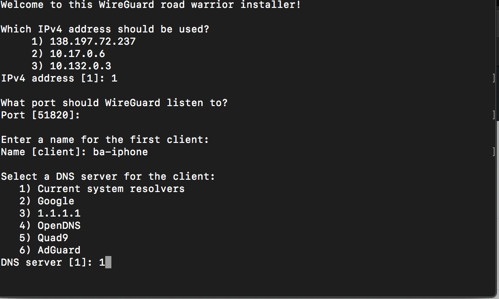

# Mobile PiHole VPN - protected by WireGuard.

This is a (semi) comprehensive tutorial on how to setup WireGuard on Ubuntu, and then setup a basic PiHole server that only listens on the client WireGuard subnet. This guide expects you to have moderate experience with any Linux distro, particularly Ubuntu, and also to have a basic understanding of what PiHole and WireGuard do and how they work (in a general sense, at least). This guide is up to date as of 01/16/2021, and is using Ubuntu 20.04 and the latest versions of WireGuard in the repo, and PiHole as of this date.

First things first - get yourself a VM or VPS. I've used Digital Ocean for years, mainly because I enjoy their user interface. After doing the initial install of Ubuntu, and updating all packages, jump into the root user and install PiHole using this command:

    curl -sSL https://install.pi-hole.net | bash

(obtained from https://github.com/pi-hole/pi-hole/#one-step-automated-install)

I picked the default options. After install, we need to change the system resolver to point at your PiHole. To do this for Ubuntu, edit your /etc/netplan/50-cloud-init.yaml file by running

    nano /etc/netplan/50-cloud-init.yaml

Edit the file underneath the `eth0` interface (or another interface if appropriate) and then change the nameservers: addresses: to show:

    nameservers:
                addresses:
                - 127.0.0.1 

run `netplan generate && netplan apply && reboot` to apply the new DNS resolver.
Now, your PiHole is listening on the open internet. This is extremly unsecure so let's protect it behind a VPN.

Install WireGuard using this command:

    wget https://git.io/wireguard -O wireguard-install.sh && bash wireguard-install.sh

This command is using the wonderful script written by Nyr. This will setup WireGuard, and will provide an easy to use interface for adding new devices to your server. It will ask you which IPv4 address it should use - pick the one that is not a private address. On both servers that I have setup recently, it is the first option. It will then ask for the port - I allowed it to use the default, 51820. Then, it will ask for a first client name - I'm using ba-iphone. For the DNS resolver, use the system resolver.

Anytime you add a client with this script, including upon first run, it will generate both a QR code and a config file. You can scan the QR code with the official WireGuard app - this will add all of the values from the .conf file.

Now that we have installed WireGuard and added a client, we need to configure PiHole so that it only will be available on devices connected to the VPN. Run `pihole -r` and choose "Reconfigure". Change the Interface to wg0. Pick the default settings until you reach Static IP Address. Hit "No", and then change to `10.7.0.1/24` and the Gateway to `10.7.0.1`. Choose defaults for the rest.

Now your PiHole DNS resolver is only accessible via your WireGuard interface! But the admin page is accessible via the public IP address. Edit the lighttpd external.conf file by running `nano /etc/lighttpd/external.conf` and inserting `server.bind = "10.7.0.1"`.

## *And that's all!*